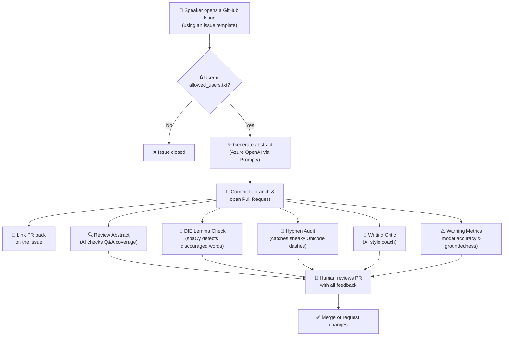

# MondrianMuse

An AI-powered content pipeline that turns a handful of answers into polished conference abstracts and workshop descriptions — then reviews its own work before a human ever sees it.

Open a GitHub Issue, answer a few questions about your talk, and MondrianMuse generates a draft abstract, opens a pull request, and runs a battery of AI and NLP quality checks — all automatically.

## How It Works



## Folder Structure

```
MondrianMuse/
├── abstracts/              # Accepted presentation abstracts (Markdown)
├── workshops/              # Accepted workshop descriptions (Markdown)
├── pr-abstracts/           # Pipeline for generating & reviewing abstracts
│   ├── create-abstract.prompty      # Prompty template for abstract generation
│   ├── review-abstract.prompty      # Prompty template for Q&A coverage review
│   ├── writing-critic.prompty       # Prompty template for style checks
│   ├── create-abstract_promptflow.py
│   ├── review-abstract_promptflow.py
│   ├── writing-critic_promptflow.py
│   ├── create-pull-request.py       # Generates abstract, commits, and opens a PR
│   ├── die-lemma.py                 # NLP check for discouraged words via lemmatisation
│   ├── hyphen-check.py              # Detects en-dashes, em-dashes & non-breaking hyphens
│   └── warning-metrics.md           # Model accuracy / groundedness disclaimer
├── pr-workshops/           # Same pipeline, tailored for workshop descriptions
├── notebooks/
│   └── lemmas.ipynb        # Demo notebook explaining lemmatisation with spaCy
├── .github/
│   ├── workflows/
│   │   ├── pull-request-abstract.yml   # Workflow triggered by "abstract" issues
│   │   └── pull-request-workshop.yml   # Workflow triggered by "workshop" issues
│   └── ISSUE_TEMPLATE/
│       ├── abstract-issue-template-v2.yml
│       └── workshop-issue-template.yml
├── allowed_users.txt       # GitHub handles permitted to trigger generation
└── requirements.txt        # Python dependencies (langchain, promptflow, spacy, etc.)
```

## License

You're free to use this project according to the [MIT License](LICENSE). The two things I ask:

1. Please credit this project when you use it.
1. Please remove my examples from the prompts in this project. **Use your own to give it your signature style!**
